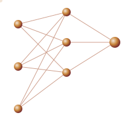

<p align="center">
  
</p>

<table>
<tr>
<td width="65%" valign="top">

```python
class Agatha:
    def __init__(self):
        self.nome = "Ágatha Natasha"
        self.idade = 20
        self.curso = "Engenharia de Software - UnB"
        self.interesses = ["IA", "redes neurais", "dados", "algoritmos"]

    def __repr__(self):
        return "explorando como sistemas inteligentes pensam"
```

</td>
<td width="35%" valign="top">



</td>
</tr>
</table>
